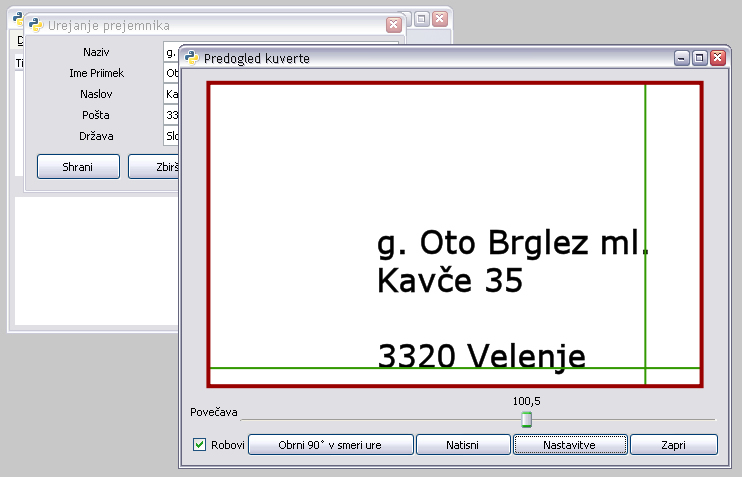

# LetterPrint

LetterPrint is simple Python application for printing paper envelopes.

> It uses Windows Printing API so don't expect it to run on anything but Windows.

I wrote this application in 2008 as part of my collage assignment.

Tools used:

- [Windows Printing API]()
- [Cairo](http://cairographics.org/examples/)
- [win32print (binding for Windows Printing API)](http://timgolden.me.uk/pywin32-docs/win32print.html)
- [Glade](https://glade.gnome.org/)

## Author
- [Oto Brglez](http://github.com/otobrglez)
